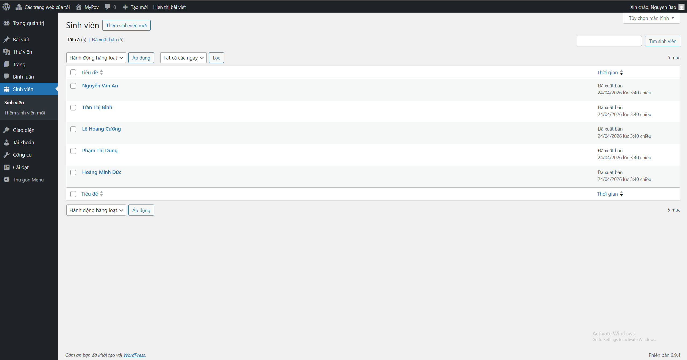
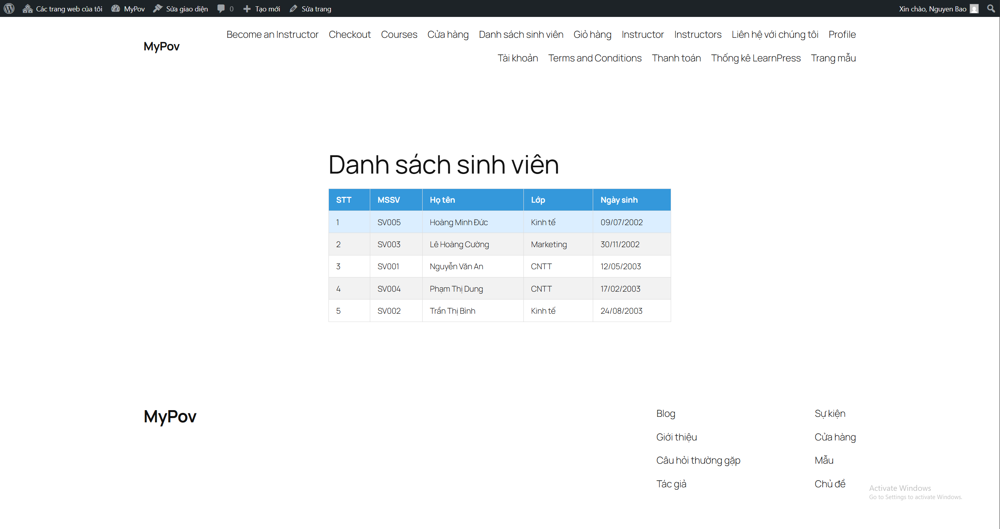
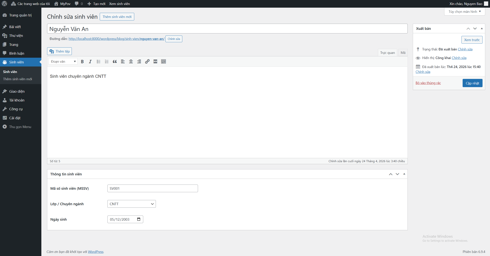

# Student Manager – WordPress Plugin

Plugin quản lý sinh viên cho WordPress được xây dựng theo yêu cầu bài thực hành ngày 24/04/2026.

---

## Thông tin sinh viên

- **Họ tên:** Nguyễn Dương Thế Bảo
- **Email:** nguyenduongthebao25@gmail.com

---

## Mô tả

Plugin "Student Manager" cung cấp đầy đủ chức năng quản lý sinh viên trên nền tảng WordPress, bao gồm:

- Đăng ký **Custom Post Type** `sinh_vien` với menu riêng trong Dashboard.
- **Meta Box** nhập thông tin chi tiết: MSSV, Lớp/Chuyên ngành, Ngày sinh.
- Bảo mật dữ liệu bằng **Nonce** và **Sanitize** khi lưu.
- **Shortcode** `[danh_sach_sinh_vien]` hiển thị danh sách sinh viên dạng bảng HTML có CSS.

---

## Cấu trúc thư mục

```
student-manager/
├── student-manager.php        # File chính: plugin header, load các file con
├── includes/
│   ├── cpt.php                # Đăng ký Custom Post Type "sinh_vien"
│   ├── meta-box.php           # Meta Box: MSSV, Lớp, Ngày sinh + lưu Nonce/Sanitize
│   └── shortcode.php          # Shortcode [danh_sach_sinh_vien]
├── assets/
│   └── style.css              # CSS cho bảng danh sách sinh viên
└── README.md
```

---

## Chức năng chi tiết

### A. Quản trị hệ thống (Backend)

| Yêu cầu | Thực hiện |
|---|---|
| Custom Post Type "Sinh viên" | `includes/cpt.php` – đăng ký CPT `sinh_vien`, hỗ trợ `title` và `editor` |
| Meta Box nhập liệu | `includes/meta-box.php` – 3 trường: MSSV (text), Lớp (dropdown), Ngày sinh (date) |
| Bảo mật | Nonce (`wp_nonce_field` / `wp_verify_nonce`) + `sanitize_text_field` trước khi lưu |

**Dropdown Lớp/Chuyên ngành:** CNTT, Kinh tế, Marketing

### B. Hiển thị dữ liệu (Frontend)

Shortcode: `[danh_sach_sinh_vien]`

Kết quả hiển thị bảng HTML 5 cột:

| STT | MSSV | Họ tên | Lớp | Ngày sinh |
|-----|------|--------|-----|-----------|
| 1 | SV001 | Nguyễn Văn An | CNTT | 12/05/2003 |
| 2 | SV002 | Trần Thị Bình | Kinh tế | 24/08/2003 |
| ... | ... | ... | ... | ... |

---

## Hướng dẫn cài đặt

1. Copy thư mục `student-manager` vào `wp-content/plugins/`.
2. Vào **Dashboard → Plugins → Kích hoạt** plugin **Student Manager**.
3. Vào menu **Sinh viên → Thêm mới** để thêm sinh viên.
4. Tạo một **Page**, chèn shortcode `[danh_sach_sinh_vien]` vào nội dung và xuất bản.

---

## Ảnh chụp kết quả

### Backend – Danh sách sinh viên trong Dashboard



### Backend – Meta Box nhập thông tin sinh viên



### Frontend – Bảng danh sách sinh viên


